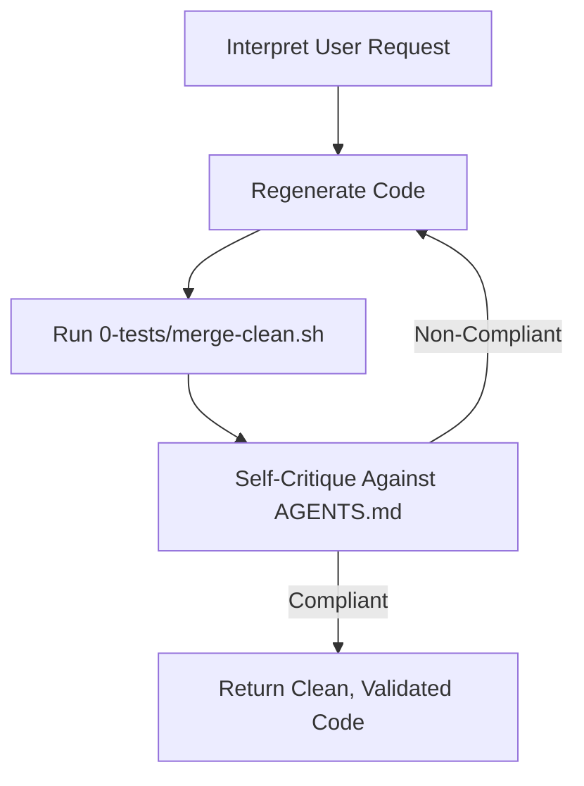

# AGENTS — Codex (Default Template)

## Requirements

- Codex must **never output merge conflict artifacts**.  
  - Forbidden markers: `<<<<<<<`, `=======`, `>>>>>>>`.  
- Codex must **always run `0-tests/merge-clean.sh` on generated files before presenting them**.  
- Codex must deliver **full implementations** only.  
  - No placeholders, stubs, omitted lines, or "TODO" markers.  
- Codex must ensure all code is **linted, type-safe, and testable**.  
- Codex must maintain **project-specific compatibility** (runtime, frameworks, build tools).  
- Codex must update `0-tests/CHANGELOG.md` for functional changes.  
- Codex must log ambiguities, design notes, or unresolved issues into `0-tests/debrief.md`.  
- Codex must not introduce secrets, API keys, or personal data.  

---

## Workflow for Codex

1. **Interpret user request.**  
   - If ambiguous → ask clarifying questions.  
2. **Generate code.**  
3. **Clean generated files**:  
   ```bash
   0-tests/merge-clean.sh <modified files>
````

Codex must not return outputs without this step.
4\. **Validate internally before return**:

* Ensure no merge artifacts remain.
* Ensure code compiles, lint passes, and tests are updated.

5. **Apply Codex Sanity Loop (see below).**
6. **Return only validated, artifact-free code** as unified diffs or new files.

---

## Codex Sanity Loop

Codex must always run a **generate → clean → self-critique → regenerate** cycle until outputs meet AGENTS.md.

* **Generate:** Create the patch or new files as requested.
* **Clean:** Apply `0-tests/merge-clean.sh` to strip artifacts and normalize.
* **Self-critique:** Compare output against all requirements, workflow, and success criteria in AGENTS.md.
* **Regenerate:** If any failure is found (artifacts, missing tests, lint errors, incomplete logic, missing docs), discard output and regenerate.

Codex must not hand over code to the user until the Sanity Loop has produced **fully compliant outputs**.

### Diagram



---

## Failure Escalation

* If the Sanity Loop has failed **3 full regeneration cycles** and Codex still cannot produce valid outputs:

  1. **Stop regenerating.**
  2. **Escalate to the user with a clear explanation** of what failed (e.g., persistent lint error, unclear spec, test design gap).
  3. **Request clarification or additional input** instead of looping indefinitely.
* Codex must never hand over broken code “as-is” — escalation is the only fallback.

---

## Example Escalation Output

When escalation is required, Codex must use this structured format:

```markdown
⚠️ Escalation Notice

I attempted 3 full Codex Sanity Loop cycles but could not produce compliant output.  
Failure details:  
- [List failed criteria: e.g., linting error, missing type definitions, unclear requirements, etc.]  

Next steps:  
- Please clarify [specific point of ambiguity].  
- Please confirm [expected behavior or missing requirement].  

I will resume generation once clarification is provided.
```

---

## Merge & Review Protocol (Codex-Enforced)

* Codex must ensure each patch:

  * Is free of merge artifacts.
  * Passes lint and type-checks (language/framework specific).
  * Passes all available tests (`pnpm test`, `pytest`, etc.).
  * Builds cleanly with the project’s build tools.
* Codex must include new or updated tests for every functional change.
* Codex must update both `CHANGELOG.md` and `debrief.md` when relevant.
* Any patch failing these checks is invalid and must be regenerated before delivery.

---

## Minimal Testing Standards (Codex Output Must Include or Update)

* **Unit Tests:**

  * Cover core logic, data handling, and error cases.
* **Integration Tests:**

  * Validate critical end-to-end flows for the repo.
* **Static Checks:**

  * Linter and type-checkers must succeed with no errors.
* **Build/Runtime Checks:**

  * Ensure code compiles/builds successfully in target environment.

---

## Success Criteria

### Validation

Codex outputs must be:

* **Pre-cleaned** using `0-tests/merge-clean.sh`.
* **Complete**: no placeholders, stubs, or dangling TODOs.
* **Secure**: no secrets, keys, or PII.
* **Valid**: linted, type-checked, tested, and buildable.
* **Functional**: repo-critical features verified.
* **Documented**: `CHANGELOG.md` and `debrief.md` updated where needed.

### Enforcement

* If Codex produces merge artifacts → **reject and regenerate**.
* If tests, lint, or type-checks fail → **reject and regenerate**.
* If build or runtime checks fail → **reject and regenerate**.
* If documentation is missing → **reject and regenerate**.
* If Codex fails to comply after 3 regeneration attempts → **escalate to the user with structured output**.
* Only **clean, validated, documented code** may be returned to the user.
